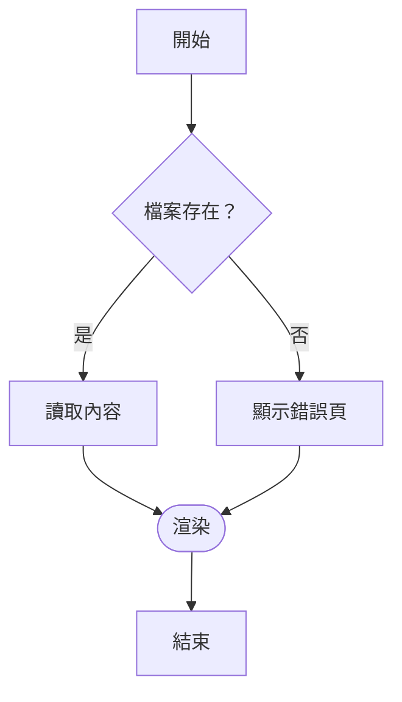
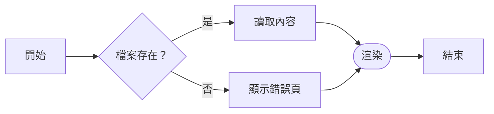
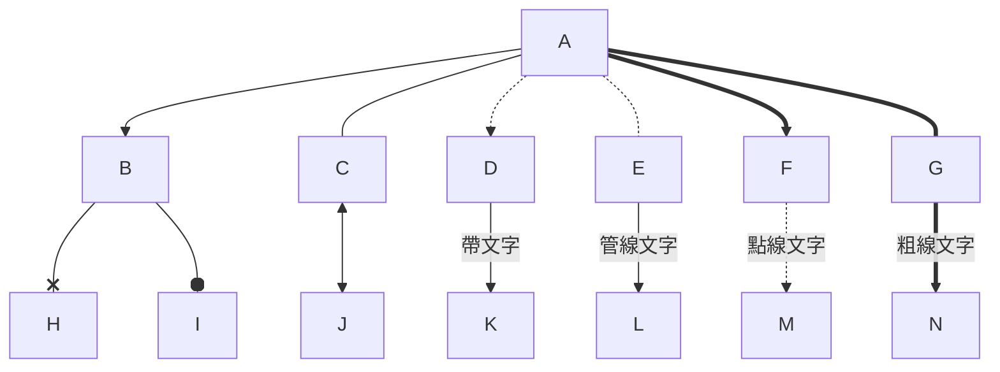
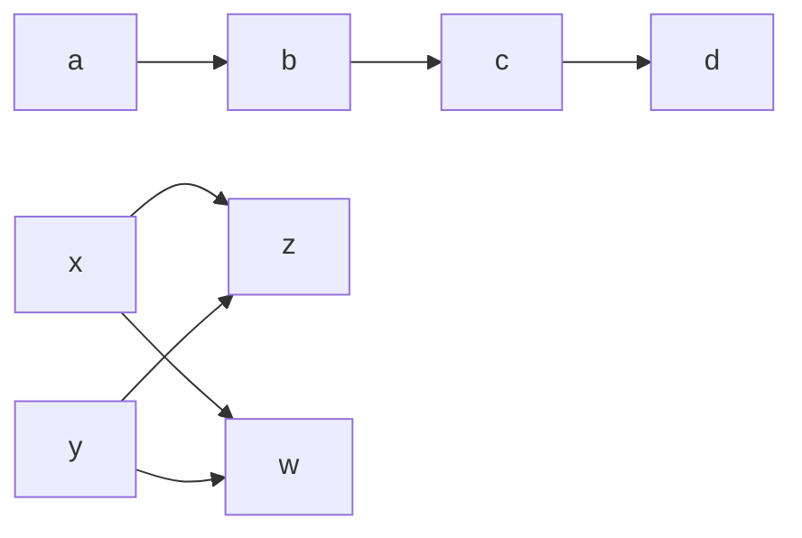
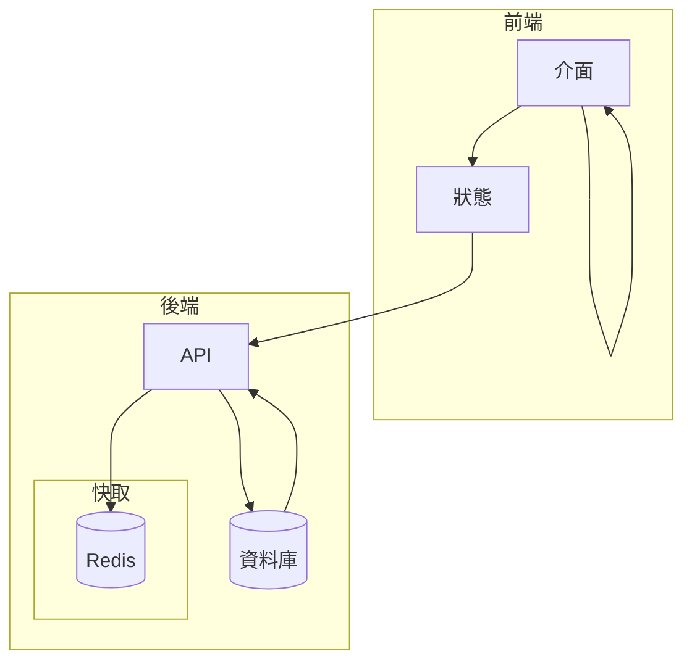
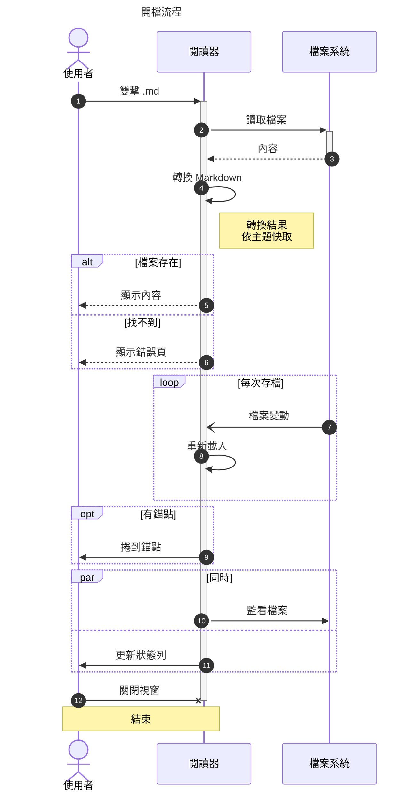
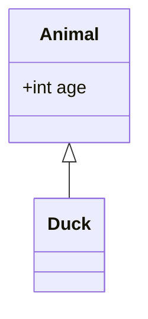

# Mermaid 測試

這份文件用來實際驗證閱讀器**內嵌的 Mermaid 子集渲染器**。用閱讀器打開它，
每一節的圖都應該直接畫出來；最後兩節是故意不支援與故意寫錯的，用來對照退路。

> 畫出來的是「語意正確、配色跟閱讀器走」的圖，不是 mermaid.live 的像素複製品。
> 深淺色主題、字級縮放、高 DPI 都會跟著閱讀器變。

---

## 1. 流程圖：方向與基本連線



同一張圖改成由左到右：



---

## 2. 流程圖：所有節點形狀


---

## 3. 流程圖：連線種類與標籤



鏈與 `&`：



---

## 4. 流程圖：子圖（可巢狀）與迴圈



`style`、`classDef`、`class`、`linkStyle`、`click` 這些只影響官方外觀的敘述會被接受但忽略：


---

## 5. 序列圖



---

## 6. 這些會失敗（故意的）

以下兩節**應該**顯示成「一行標示 + 原始碼區塊」。這是預期行為，用來對照。

### 6-1. 未支援的圖表類型



### 6-2. 語法錯誤（第 3 行）

```mermaid
graph TD
    A --> B
    這一行不是合法的敘述 !!!
    B --> C
```

---

## 結論

| 類型 | 結果 |
|------|------|
| flowchart / graph（TD、TB、BT、LR、RL） | ✅ 內嵌畫出，13 種節點形狀、各種連線與標籤、子圖 |
| sequenceDiagram | ✅ 內嵌畫出，參與者／訊息／啟用／便條／loop、alt、opt、par、critical、break |
| class、state、ER、gantt、pie、mindmap… | ❌ 顯示原始碼 + 「尚未內嵌支援」標示 |
| 語法錯誤 | ❌ 顯示原始碼 + 「解析失敗（第 N 行）」標示 |

圖太大（節點超過 300、連線超過 600、訊息超過 400）時也會退回顯示原始碼——
純 Python 的版面演算法在那個規模已經不划算了。
